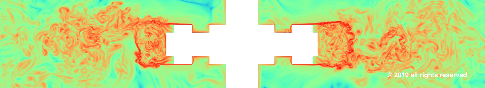

# TURBULENT Dynamics QVec GUI

Turbulent Dynamics specialises in running high-resolution fluid dynamics simulations on supercomputers. The application decomposes the simulation space into smaller grids and each grid is run on one node. During the simulation each node creates output files independently and this application is used to stitch these files together and do some post processing calculations.

This repo provides a graphic utility to read tdQVec files and display either vector representations in 2D or 3D or other type of visual output.  A QVec File is binary output from the Q vectors of a Lattice Boltzmann simulation, see the package [tdQVecTool package](https://github.com/TurbulentDynamics/tdQVecTool) for more information or its [documentation](https://turbulentdynamics.github.io/tdQVecTool/).

This app is built with SwiftUI and can be used on MacOS or iPad and will use Metal for vector visualisation.

